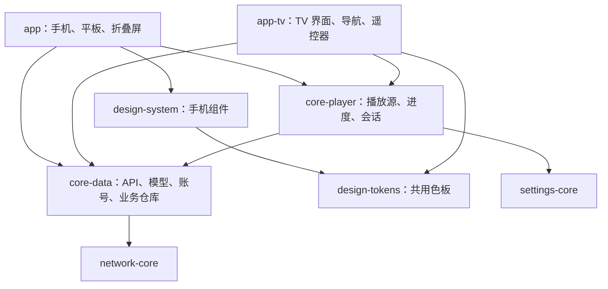

# BiliPai TV 适配实施记录

## 决策与边界

在当前 BiliPai 仓库新增 `:app-tv`，独立包名 `com.android.bilipai.tv`、独立安装包；不使用旧 TV 仓库。最低 Android 8.0，面向 Android TV、Google TV 和普通安卓盒子。手机与 TV 的界面、交互、凭据和本地偏好分别保存，服务端账号数据按各端登录的账号同步。

共享模块不依赖应用页面、导航、手机 ViewModel 或手机主题。共享代码中仍保留原 `com.android.purebilibili` 包名，以减少手机调用方迁移成本。诊断日志、API 错误上报和隐私设置通过 `CoreNetworkConfig` 注入；手机继续使用原来的日志及错误上报，TV 使用自己的配置。

## 本次实现范围

阶段一的代码骨架及纵向链路已实现，同时接入阶段二的部分页面。2026-10-02 用户明确要求启动 TV 虚拟机并执行脚本测试后，已生成并安装 TV Debug 包。当前适合进行基础观看原型验收；完整 TV 功能、视觉设计和兼容验收尚未完成。

| 能力 | 当前代码状态 |
| --- | --- |
| 独立 TV 应用 | TV 和普通启动入口、横屏、图标、Banner；触屏、摄像头和 Leanback 均非必需硬件 |
| 共用数据 | 网络客户端、响应模型、会话存储、搜索、收藏、历史、稍后再看仓库已迁移；手机改为依赖共享模块 |
| 共用播放 | DASH 清单与进度存储已迁移；APP 播放请求签名、观看心跳由两端调用同一实现 |
| TV 播放会话 | Media3、DASH/渐进式媒体源、暂停、进度、倍速、画质、分 P、结束后重播或下一 P、错误重试与手动 480P 回退 |
| 弹幕 | 分段读取与字节缓存下沉 `:core-data`（`DanmakuContentRepository`），解析器（XML/protobuf/BAS）迁入 `:danmaku-engine` 的 `com.android.purebilibili.danmaku.parser` 包（脱离 feature 命名空间以便 TV 引用），两端调用同一实现；TV 播放页以被动覆盖层渲染标准弹幕，半屏默认密度，播放/暂停/seek/倍速同步到引擎 |
| 浏览链路 | 推荐 → 详情 → 播放 → 返回；列表按视频标识恢复焦点和滚动位置，分页保持当前焦点 |
| 搜索 | 系统输入法、搜索历史、热词、分页、空结果提示 |
| 账号 | 游客观看；TV 接口扫码、过期刷新、离开取消、已扫码提示、退出登录、失效后的重新登录入口 |
| 个人内容 | 历史、收藏夹及夹内视频、稍后再看；详情支持加入稍后再看 |
| 本地设置 | 默认画质、自动下一 P、弹幕开关、暂停观看历史上报、清空搜索历史 |
| 续播 | 按 CID 存储进度；TV 记住最近观看的分 P；本地缺少进度时使用匹配 CID 的服务端进度 |
| 系统控制 | 已建立 MediaSession，支持媒体播放/暂停键；系统音量键不拦截 |
| 设计复用 | 将现有色板原样抽入 `:design-tokens`，手机通过原设计系统继续导出，TV 直接使用；深色文字、侧栏选中态、粉色焦点边框已统一 |

手机原有缓存、推荐合并、播放回退和高级播放器编排仍在手机端；本次未把手机播放器 ViewModel 整体搬入共享模块。后续按业务链路继续提取，抽取后两端调用同一实现。

## 遥控器约定

- 普通页面：方向键导航，确认激活，返回逐层退出；根栏目返回推荐，推荐页再返回交给系统。
- 控件隐藏：确认显示控件并聚焦播放按钮；左右开始预览跳转位置。
- 控件显示：方向键导航；进度条获得焦点后左右调整，确认提交，返回取消调整。
- 返回优先关闭弹窗，再取消进度调整，再隐藏控件，最后退出播放。
- 弹窗关闭后恢复打开它的按钮；失败状态聚焦重试入口。
- 独立播放/暂停键直接控制播放，音量键交给系统。

## 设计与动效复用

TV 已有可操作界面，仍是观看原型。颜色使用同一份既有定义，保持原包名、字段和数值；没有把手机组件包整体接入 TV。字体、间距、圆角和纯展示区域下一步在梳理依赖后逐项共用。导航、遥控器焦点、弹窗和播放操作仍由 TV 组件实现。

可优先接入短时焦点缩放、选中反馈、页面及控件淡入淡出；参考手机的运动曲线和节奏，TV 调整幅度和持续时间。当前已使用 Compose for TV 组件自带焦点反馈，尚未接入手机的自定义动效规范。不默认启用持续背景动画、重模糊或手机触摸拖拽动效。

现有静态矢量 Banner 可用于原型验收，正式品牌图后续完善。官方要求提供 16:9 Banner 和启动图标，可采用前景/背景分层的自适应资源：[Android TV 图标规范](https://developer.android.com/design/ui/tv/guides/system/tv-app-icon-guidelines)。应用内动效独立实现，不依赖桌面 Banner 播放动画。

TV 页面改动不会被手机调用。共享核心和设计定义仍是两端公共依赖，不能承诺所有共享修改对手机零影响；手机账号、推荐、播放及进度回归尚未验收。

## 检查与已有测试

可独立运行 `python3 scripts/check_tv_architecture.py`，无需 Gradle。检查模块依赖方向、手机运行时依赖、入口、非必需硬件、资源 XML 和共享声明重复问题。本次该检查及 `git diff --check` 通过。

另使用独立 Kotlin 语法解析器扫描本次涉及的代码，无新增语法诊断；旧文件中已有的解析器限制不作为类型检查结果。以上检查**不覆盖 Kotlin 类型、依赖解析、焦点运行行为或真实接口结果**。

已运行通过 10 项单元测试：

- `TvFocusPolicyTest`：条目重排、删除后的焦点回退、进度边界、分层返回。
- `PlaybackResumePolicyTest`：新分 P 从头播放、本地/服务端进度优先级、看完后重新进入、越界进度。
- `PlaybackStreamDataSourceTest`：TV/Android 凭据分别使用对应签名参数，保留分 P、画质和音轨语言。

`Television_4K`（Android 36，3840×2160）上运行通过 5 项隔离 UI 测试：

- `TvRemoteNavigationTest`：方向键和确认进入详情、返回后原卡片焦点、追加分页保持焦点、侧栏返回当前行（3 项）。
- `TvSearchInputTest`：实体 Enter 提交、向下移动到搜索按钮并确认提交（2 项）。

启动脚本为 `./scripts/launch_tv.sh`，默认只使用已有 APK；只有明确加 `--build` 才编译。遥控器脚本为 `python3 scripts/tv_smoke.py --device emulator-5554`，不调用 Gradle，使用 ADB 方向键和语义/焦点断言，生成报告到 `app-tv/build/outputs/tv-qa/`。真实接口错误或播放时钟不推进记为失败。脚本不会确认扫码、退出账号或更改收藏。

本轮真实接口测试全部通过：推荐 → 详情 → 播放时钟推进 → 媒体键暂停/继续 → 快进预览取消 → 分层返回 → 恢复原卡片焦点；设置弹窗关闭与焦点恢复；系统输入法输入并搜索；账号页进入与返回取消。报告为 `app-tv/build/outputs/tv-qa/20261002-acceptance-final/report.json`，隔离 UI 测试日志为同目录 `instrumentation.txt`。测试结束应用停留在推荐页。

这只证明当前原型在该虚拟机上的基础链路，不能作为完整 TV 验收结论。扫码成功、过期、画质切换、多 P、续播、网络恢复及 Android 8/普通盒子仍未验收。

## TV UI 与交互规格（2026-10-02）

本节是推荐、详情、播放器的实施规格，当前接入进度见下方记录。沿用 BiliPai 的字体、圆角、颜色及组件语义；参考 tvOS 的内容层次、远距离阅读、方向焦点与轻量反馈。以下尺寸及动画参数为本项目的初始设计值，不是 Apple 官方数值。

### 设计来源与复用边界

设计方法：以 Apple TV 等成熟电视产品的交互与信息架构为参照——悬浮侧栏、全幅轮播 banner、环境光背景、焦点缩放与轻量反馈；视觉参数取自 BiliPai 移动端既有的 design-tokens（字体、字重、间距档位、圆角语义、品牌色），按 10 英尺阅读距离与遥控器交互重新取档。不照搬手机布局，不引入第二套视觉体系；每项尺寸调整先对照移动端原值，再给出 TV 取值与理由。

- [Apple：Designing for tvOS](https://developer.apple.com/design/human-interface-guidelines/designing-for-tvos/)：突出内容，保证远距离可读，使用清晰的焦点反馈。
- [Apple：Focus and selection](https://developer.apple.com/design/human-interface-guidelines/focus-and-selection/)：焦点与选中分开；方向键可达；避免无故抢焦点；内容移除后提供可预测的焦点回退。
- [Apple：Remotes](https://developer.apple.com/design/human-interface-guidelines/remotes/)：按键作用一致，操作有清楚反馈。这里落实到 Android 方向键、确认、返回和媒体键，触控遥控器手势不作为前提。
- [Apple：Meet Liquid Glass](https://developer.apple.com/videos/play/wwdc2025/219/)：参考控件与内容的分层。TV 默认使用现有深色表面与渐变遮罩，重模糊、折射与持续背景动画暂不启用。

改造前 `TvTheme` 仅共享颜色；本轮已在源码中接入共享字阶与形状，运行效果尚未验证。移动端 `AppCard`、按钮和列表项已具备内容插槽及状态接口，但其渲染依赖 Material 3 / Miuix 手机主题。TV 不整包引入 `design-system`，也不把 TV 加成第三种手机主题。

| 现有定义或组件 | 共享内容 | TV 适配职责 |
| --- | --- | --- |
| `Color.kt` | 已共享品牌色、深色背景及文本颜色 | 对比度、焦点与选中状态映射 |
| `Type.kt` | `Md3Typography` 的字体、字重、字距、中文行高策略 | 单独映射阅读字号，保留文字缩放；不使用废弃的 `BiliTypography` |
| `AppShapes` | 容器语义、当前 Material 3 圆角解析结果 | 各状态统一轮廓；后续若支持 Miuix，接入其已有解析规则 |
| `AppSpacingTokens` | 现有间距档位 | 选择适合远距离阅读的档位 |
| `AppMotionEasing` | 纯动画曲线 | TV 的时长、幅度、减少动画策略 |
| `AppCard` / `AppPrimaryButton` | 内容、图标、状态、激活回调 | TV Card / Button 渲染、焦点、按下反馈；不依赖手机触觉反馈 |
| `AppListItem` / 开关 | 内容插槽、值与回调 | 整行可聚焦、确认切换，避免一行重复焦点 |
| 对话框 / 进度条 | 标题、选项、进度与动作 | TV 布局、弹窗焦点、方向键进度预览和提交 |

共享定义抽取时保留原包名、原值及手机默认行为，由 `design-system` 继续导出。依赖手机主题或 Miuix 几何库的解析器先留在原模块，纯定义按需抽取；禁止为方便 TV 而复制一套业务实现。TV 初始延续当前 Material 体系；手机主题选择不自动控制 TV，也不修改手机主题默认值。

### 共同视觉规则

尺寸使用逻辑 dp / sp，按窗口实际可用空间布局，不能根据 1080p / 4K 像素分辨率直接加倍。现有 TV 虚拟机窗口约为 960×540dp，作为初始排版参考；窄窗口减少列数，文字放大时允许布局增高。

| 用途 | 初始规格 |
| --- | --- |
| 页面外边距 | 32dp；焦点放大空间包含在列表内边距中 |
| 侧栏 | 悬浮面板 200dp，默认隐藏、内容左边界按左键呼出；选中与焦点状态分别表示 |
| 卡片间距 | 横向 16dp，纵向 16dp（密度评审调整）；内部文字间距 8dp，内边距 12dp |
| 按钮 | 最小高度 48dp；不设裁切大字号文字的固定高度 |
| 页面标题 / 详情标题 | 28sp / 36sp 行高，采用现有 `headlineMedium` 字形与字重 |
| 卡片标题 / 操作标签 | 卡片标题 16sp / 24sp（小卡密度的 10 英尺下限）；操作标签维持 18sp / 26sp `labelLarge` 字形字重 |
| 正文 | 18sp / 26sp 行高，继承现有正文样式 |
| 次要信息 | 页面次要 16sp / 24sp；卡片内 UP 主等次要信息 14sp / 20sp；关键提示不降为小字号 |
| 首页氛围层 | 当前轮播封面高斯模糊铺底 + 深色渐变；banner 图像底部 alpha 渐隐融入氛围层，不允许出现横向断层 |

圆角从 `AppShapes` 对应语义解析：封面用 `MediaCover`、普通卡片用 `Card`、浮层用 `Floating`、弹窗用 `Dialog`、按钮用既有按钮形状规则。尺寸增大不自动增大圆角，不新增“苹果圆角”。背景、内容裁切、焦点边框使用同一个形状。长标题允许两行，次要信息一行省略；详情提供阅读完整标题及简介的路径。

焦点卡片初始放大到 1.04 倍，配合 2dp 品牌色边框；按钮优先用现有粉色与背景对比表达焦点。选中侧栏保留粉色标记，聚焦但未确认的项目增加独立轮廓，不能只靠文字前的圆点判断状态。不可用项保持可辨识，操作失败给出可读原因和可操作的恢复入口。

焦点响应逻辑立即生效，视觉过渡约 120ms，继承现有 `Continuity` 曲线；页面及浮层淡入淡出约 180ms。连续方向键输入从当前动画值转向新目标，不等待动画完成、不延迟点击、不在每次获得焦点时重新触发整页动画。优先让 TV 组件自带反馈承担动画，避免重复叠加缩放。减少动画时移除缩放和位移，保留即时边框与颜色反馈；动画关闭不改变导航逻辑。

### 推荐页（2026-10-03 评审后改为沉浸式首页）

参照 Apple TV 的信息架构：全幅轮播 banner + 环境光背景 + 悬浮侧栏，替代原型的「常驻侧栏 + 标题 + 纯网格」。此前的「首版保留纵向网格、不新增自动播放 Banner」为初始保守值，经密度与形态评审后按本节执行。

- 全幅轮播 banner：取推荐流前 6 个视频，16:9 封面，底部渐变上叠标题与「播放 / 查看详情」，7 秒自动轮播；banner 持有焦点或系统减少动画时暂停。播放按钮在推荐流带 cid 时直达播放器，否则走详情兜底。
- 整页背景为当前轮播封面的高斯模糊氛围层（Coil 极小尺寸请求 + blur；低版本系统退化为小图拉伸），上盖深色渐变保证对比度；banner 图像底部经 alpha 渐隐融入氛围层，不允许出现横向断层；切换封面时氛围层交叉淡入。
- 悬浮侧栏默认隐藏：内容区占满全宽；内容左边界按左键聚焦导航项时侧栏滑入（240ms，减少动画时瞬时），按右键或返回先回到最近聚焦的内容。侧栏悬浮于内容之上，不改变内容宽度。
- 信息流卡片最小宽度 150dp（密度评审由 220dp 下调）：960dp 窗口 4~5 列，卡片标题 16sp 两行、UP 主 14sp 一行，封面 16:9，固定标题区域容纳两行。
- 分页自动进行：滚动接近末行即追加下一页，不设「加载更多」按钮，分页不抢焦点；自动分页失败后停止自动重试，以错误行「重试」恢复。
- 进入页面聚焦第一个视频卡片（与遥控器验收一致），从首行向上可聚焦 banner 主操作；详情或播放返回按稳定视频 ID 恢复焦点与滚动位置；原条目移除时使用邻近条目，列表为空时回退到刷新或重试入口。
- 仅确认激活卡片，焦点移动不请求详情、不自动切换页面。封面与静态文字不单独成为焦点。加载、错误、空列表保留可操作的刷新或重试入口。未来接入真实续播数据后再增加「继续观看」内容行，不先做空入口。

### 视频详情页

宽窗口使用封面与信息两栏，封面约占主内容宽度的 40%，最大 320dp；空间不足时改为上下布局。保留标题、UP 主、主要播放按钮、稍后再看、简介及分 P，先完成当前已有功能的视觉适配。

- 首次加载完成后聚焦播放按钮；主按钮优先展示可确定的“播放”或“继续观看”，数据不足时显示“播放”，不把两种动作写成一个模糊标签。
- 标题最多两行，较长内容通过“展开详情”阅读；简介默认最多三行，有截断时提供展开动作。
- 主按钮使用品牌色，其余操作沿用普通按钮风格，焦点反馈一致。
- 分 P 使用可聚焦列表项，当前播放项有独立选中标记；长列表按需滚动，不让上方封面持续占据列表可视空间。
- 返回关闭展开浮层后恢复展开按钮；从播放器返回恢复刚激活的播放或分 P 按钮及滚动位置。再次进入新的详情默认聚焦主播放按钮。
- 加载、失败、权限不足和稍后再看操作结果都有明确文字与返回/恢复路径；不为未实现功能加入占位按钮。

### 播放器

全屏播放，控件隐藏时保留纯视频画面。显示控件时使用底部渐变遮罩、标题、可聚焦进度轨和一行主要动作；标题和说明不占据过多视频面积。常驻提示仅在对应操作状态出现。

- 控件隐藏：确认只显示控件并聚焦播放按钮；左右进入进度调整；媒体播放键直接控制播放。
- 控件显示：方向键导航；进度轨聚焦时左右按现有 10 秒步长调整，显示预览时间及目标位置；确认提交一次跳转，返回取消预览，不写入观看进度。
- 进度未知或内容不可跳转时禁用调整，给出可读说明；不能显示假进度轨或用零时长计算比例。
- 画质、倍速、选集弹窗初始聚焦当前选中项，选中标记与焦点区分；选项过多时滚动，关闭后恢复触发按钮。弹窗打开期间背景控件不响应方向键。
- 返回顺序保持现有规则：关闭弹窗 → 取消进度预览 → 隐藏控件 → 退出播放。每次返回只处理一层。
- 自动隐藏保留现有 8 秒策略；暂停、弹窗、进度预览和失败状态不自动隐藏操作路径。方向键操作重置计时。
- 重试、兼容画质重试和返回详情保持可聚焦。播放结束提供重播及返回；系统音量键交给系统。
- 当前已有的 `tv-player`、`tv-seek`、`tv-play-pause` 等语义标识保留，便于验证行为。

### 实施顺序与功能验收

1. 抽取必要的纯字阶、间距、形状定义和动画曲线，接入 `TvTheme` 与 TV 卡片/按钮适配器；手机保持消费同一来源及原默认值。
2. 接入推荐页，确认焦点反馈、分页、返回恢复和字体放大不裁切；此时保留现有网格与分页业务。
3. 接入详情页，补齐完整标题/简介展开、主操作文案、分 P 导航和播放器返回恢复。
4. 接入播放器视觉进度轨、控件过渡和选择弹窗，保持既有遥控器规则与进度语义。

每步分别检查：快速连续方向键不丢焦点；确认只激活一次；焦点放大不被父容器裁切；选中项与当前焦点可区分；字号增大不隐藏必要操作；减少动画仍能定位焦点；返回保持同一内容及滚动位置。共享定义抽取要对照手机原定义确认值、包名及导出关系保持一致，不能仅凭 TV 页面独立就宣称手机完全无影响。

当前共享基础、TV 卡片/按钮及推荐页已接入源码，尚未验证运行效果；详情和播放器的完整视觉适配待实现。

## TV 基础组件实施说明

本节细化前述 UI 规格，作为代码实施顺序；已创建项及待完成项见下方记录。优先完成共享基础与推荐页，再扩展详情和播放器。

### 模块依赖与抽取步骤

目标依赖维持 `:app → :design-system → :design-tokens` 和 `:app-tv → :design-tokens`。手机 renderer、手机主题配置、导航及触觉反馈留在 `design-system`；TV renderer、焦点及遥控器处理留在 `app-tv`。共享模块不得依赖任一应用。

| 抽取项 | 实施方式 | 手机保持一致的条件 |
| --- | --- | --- |
| 间距 | 原样迁移 `AppSpacingTokens`，保持包名与所有值 | 原 import、字段及解析结果不变 |
| 字体 | 在共享模块提供基础 `TextStyle` 集合，抽出 `Md3Typography` 使用的字体、字重、字距与中文行高定义 | 手机 `Md3Typography` 继续装配原有 15 个槽位及原字号；TV 使用同一基础样式，覆盖指定字号和行高 |
| 容器形状 | 抽取 `ContainerLevel` 与基础圆角定义；保留手机 `AppShapes` facade，以共享定义装配既有结果 | 手机主题缩放、Miuix 特殊值及 squircle 路径仍走原解析流程 |
| 动画曲线 | 将纯 `AppMotionEasing` 移到共享模块并保持包名；手机 `AppMotionTokens` 使用相同曲线 | 原 tween 时长、spring 参数和 Miuix Folme 依赖仍留在手机模块 |

不直接迁移整个 `Type.kt`：其中同时包含 Material Typography 容器、废弃字阶及 Miuix 字阶。共享基础不需要引入手机 Material 3 组件库。TV 的 `Typography` 与手机的 `Typography` 分别装配，但字体基础定义只保留一份。

形状也不直接迁移整个 `AppShapes.kt`：它依赖 `LocalAppUiStyle`、`LocalAppThemeConfig` 和 Miuix 几何实现。TV 的初始形状映射必须等于现有 Material 3 解析结果，不能直接把注释中的 base 值当作最终圆角；基础值和主题缩放应来自同一来源。若抽取需要拆分纯主题标识或缩放常量，应同步调整手机解析器，保留其公开接口。

按需为 `design-tokens` 增加 Compose 文本、单位、形状或动画核心依赖，不加入 Haze、Cupertino、Miuix、生命周期、导航及播放器依赖。迁移公开类型后删除旧定义，避免同包同名类型和两份参数表。

### TV 组件接口约定

新增文件均放在 `app-tv/src/main/java/com/android/bilipai/tv/ui/` 下；基础组件可放在其 `components/` 子目录。基础卡片、按钮、侧栏、视频卡片及 TV 样式映射已创建；选择弹窗改造仍为待完成项。

| 拟定组件 | 输入与内容 | 组件内部职责 |
| --- | --- | --- |
| `TvUiTokens` | 共享样式、TV 的字号/间距/焦点参数 | 提供尺寸映射，不读账号、播放或导航状态 |
| `TvAppCard` | `onClick`、`modifier`、`enabled`、可选 `interactionSource`、内容插槽 | TV Card 渲染、统一形状及焦点反馈；业务内容和焦点恢复由调用者处理 |
| `TvAppButton` | `onClick`、`modifier`、`enabled`、`isLoading`、内容插槽 | 统一按钮形状、大小及状态，支持图标和文字；加载时防止重复激活 |
| `TvNavigationItem` | 标题/图标、`selected`、`onClick`、`modifier` | 区分选中、聚焦、按下、不可用，不自行切换路由 |
| `TvVideoCard` | 视频标题、封面、UP 主、`onClick`、`modifier` | 装配视频内容，使用 `TvAppCard`；不在聚焦时加载详情 |
| `TvChoiceDialog`（改造已有组件） | 标题、稳定 ID 选项、当前选中 ID、选择与取消回调 | 弹窗布局及选项导航；初始焦点落到当前项，无当前项时落到首个可用项 |

`modifier` 由调用者传入，以保持现有 `testTag`、`focusRequester` 和 `onFocusChanged` 可接入。组件采用内容插槽，避免为每一种业务内容新增大量布尔参数。首版不迁移手机 `AppCard` 和 `AppPrimaryButton` 的整套实现；复用其内容/状态/动作约定，TV adapter 使用 TV 原生控件。若后续出现确实相同的静态内容布局，再抽取该布局，不能提前声称两端已经共用同一个组件实现。

一次确认仅触发一次 `onClick`，不在基础控件外再套一个会重复拦截确认键的点击层。必要操作不能只挂在长按上。组件自己不创建业务 ViewModel，也不持有其他页面的 `FocusRequester`。

`isLoading` 从业务状态传入；加载视觉出现时仍需保留合理的焦点位置。若原控件转为不可聚焦，页面将焦点移到明确的恢复入口；加载结束不无条件抢回焦点。原型阶段不新增持久化的主题、动画或布局设置；减少动画优先遵循系统能力，必要的 TV 配置独立保存。

### 焦点与状态所有权

| 状态 | 所在层 | 更新时机 |
| --- | --- | --- |
| 当前路由、当前根页面 | 现有 `TvAppViewModel` | 确认导航、返回 |
| 列表最后聚焦 ID、索引、滚动位置 | 现有 `TvCatalogState` | 焦点改变、列表滚动；以内容 ID 恢复 |
| 聚焦/按下视觉 | 基础组件的交互状态 | 由控件交互驱动，不保存到业务仓库 |
| 详情最后激活目标、详情滚动位置 | 按详情路由标识保存的 UI 状态 | 播放或展开前记录，返回时恢复 |
| 弹窗选中项 | 业务值 | 用户确认选择时更新 |
| 弹窗初始焦点、触发按钮 | 页面 UI 层 | 弹窗打开和关闭；不存储进共享核心 |
| 临时进度预览 | 播放器 UI 层现有 `pendingSeek` | 左右调整、确认提交、返回取消 |

列表追加只更新内容，不重新执行初始焦点请求。完整刷新优先保留仍存在的聚焦 ID；消失时使用邻近可用条目，空列表进入可操作的空态。滚动完成、目标实际进入布局后才请求焦点。弹窗关闭先移除弹窗，再恢复可见的触发按钮；触发按钮消失时使用相邻可用动作。页面销毁时取消其焦点任务，避免延迟任务抢走新页面焦点。

### 推荐页首批接入清单

1. `TvTheme.kt` 装配显式的 TV 字阶与形状，所有文字继续使用主题槽位。
2. `TvApp.kt` 侧栏接入 `TvNavigationItem`，保留既有路由、方向跳转与语义标识；聚焦不激活页面。
3. `TvVideoGrid.kt` 接入 `TvVideoCard`，保留稳定视频 ID、现有焦点恢复策略与分页回调。列数计算扣除内边距及列间距，窄窗口允许单列。
4. 列表边缘预留足够空间容纳 1.04 倍缩放及边框；不要通过放大整个网格实现单卡片反馈。
5. 保留 `video:<id>`、`tv-grid`、`tv-nav-<screen>` 标识；新增标识用于焦点/选中状态断言时，避免与已有标识重复。
6. 完成推荐链路后再接详情。详情的展开动作、动态播放文案和返回恢复属于后续功能改动，不能仅换样式就计为完成。

### 分项交付与验证记录

| 交付项 | 判断依据 | 当前状态 |
| --- | --- | --- |
| 设计基础共享 | 手机和 TV 引用同一字体/圆角/间距/曲线来源，手机原参数保留 | 源码已接入；运行待验证 |
| TV 基础组件 | 卡片、按钮、侧栏状态清晰且无重复激活 | 源码已接入；功能待验收 |
| 推荐页适配 | 方向键浏览、分页、详情返回后焦点与滚动恢复 | 已实现沉浸式首页（轮播 banner/氛围层/悬浮侧栏/自动分页），模拟器截图初验；遥控验收待跑 |
| 详情适配 | 完整内容可读，播放/分 P/展开后返回到原动作 | 待实现 |
| 播放器适配 | 进度预览提交/取消、弹窗、自动隐藏、分层返回符合规格 | 待实现 |

共享参数迁移先做源代码对照，记录原值、迁移后的定义及消费位置；后续功能验证重点观察焦点、文字裁切和动作行为。这里的待实现状态不能由文档完成或静态检查通过改为已完成，也不沿用原型测试结果作为新视觉的验收证据。

### 本轮源码接入记录（2026-10-03）

- `design-tokens` 新增 `AppTextStyles`、`AppShapeTokens`，原包名迁移 `AppSpacingTokens`、`AppMotionEasing`。手机继续通过 `design-system` 使用共享定义，原 Material 15 槽字阶、Miuix 字阶、形状基础值、间距和曲线保留。
- `TvTheme` 接入共享字体和形状；TV 字号独立映射，按钮与卡片使用 TV 原生控件。关闭系统动画时卡片不放大；系统设置变化后的即时响应尚未验证。
- 新增 `TvAppCard`、`TvAppButton`、`TvNavigationItem`、`TvVideoCard`。侧栏使用独立焦点轮廓及选中语义；卡片缩放为 1.04 倍，边框 2dp，标题预留两行。
- 推荐网格按可用宽度计算列数，允许单列，保留已有视频 ID、焦点回调、滚动记录及语义标识。刷新、分页及空态操作接入基础按钮；这些行为仍待运行验证。
- 动画目前由 TV 原生控件承担，不再叠加自定义缩放；规格中的精确时长、页面过渡和更完整的减少动画策略尚未接入。共享曲线已抽取，但 TV 尚未使用自定义曲线覆盖原生动画。
- 已做源码参数对照：15 个字阶定义、旧字阶及 Miuix 字阶、间距、基础圆角和曲线与迁移前一致；变更格式检查通过。本轮没有编译，也未运行 UI 或功能测试，不能作为视觉和焦点验收结论。

下一项为详情页：完整标题/简介展开、明确的播放与续播文案、分 P 选中表达及播放器返回后的动作焦点恢复。播放器进度轨和弹窗视觉随后接入。

### 本轮源码接入记录（2026-10-03 沉浸式首页）

- 首页改为全幅轮播 banner（`TvHeroCarousel`）+ 高斯模糊氛围背景（`TvAmbientBackdrop`）+ 悬浮侧栏（`TvSideRail`，默认隐藏、焦点呼出、右键/返回回内容）；内容区占满全宽。
- 密度调整：最小卡宽 220→150dp、网格间距 24→16dp、卡片标题 18→16sp、UP 主 14sp；960dp 窗口实测 5 列。
- 「加载更多」按钮移除，网格滚动近末行自动分页；分页失败后 `autoLoadBlocked` 阻断自动重试，错误行「重试」（刷新）解除。
- 修复 Detail/Settings/Login 页在移除常驻侧栏后丢失的页面边距；更新设置页过时的「不启用背景模糊」文案。
- 已在 TV 模拟器截图初验（hero/氛围层/侧栏呼出与返回/设置页氛围延续）；`TvRemoteNavigationTest` 等遥控器验收与焦点回归待跑。

## 后续阶段

### 阶段二：补齐完整观看闭环

弹幕读取与解析的抽取已完成（2026-10-03）：分段拉取与字节缓存下沉 `:core-data` 的 `DanmakuContentRepository`，解析器迁入 `:danmaku-engine` 的 `com.android.purebilibili.danmaku.parser` 包；TV 播放页已接入标准弹幕渲染（被动覆盖层不抢焦点、半屏盒子友好默认密度、播放/暂停/seek/倍速同步），设置提供弹幕开关。TV 暂不渲染高级弹幕（BAS）与指令弹幕，屏蔽词规则和弹幕发送为后续项；全量时间线一次性 `replaceWindow` 在超长视频上的主线程开销留待阶段四性能策略。随后完善音轨选择、播放过程中登录失效的恢复路径，以及各操作弹窗的焦点断言。当前扫码取消使用返回键，支持过期后手动刷新。

继续提取手机与 TV 都需要的播放请求及回退策略；手机的手势、弹窗、插件和全局导航仍通过端侧适配器处理。把已有共享逻辑测试逐步移到对应共享模块。

阶段二完成条件仍为：从登录、找视频到观看及续播，必要操作均能只用遥控器完成；手机账号、推荐、播放和进度行为保持一致。

### 阶段三：番剧、直播与个人内容

先做番剧追番、选集、续播和连续播放，再增加直播列表、关注及播放；扩展 UP 主空间、关注内容、点赞和收藏操作。评论先支持阅读与展开。当前不提供这些页面，也不以空按钮占位。

复用账号权限判断，统一展示权限、地区和内容不可用错误；番剧与直播的播放差异留在共享核心与端侧策略之间。

### 阶段四：性能与生态

现有 TV 播放会话只按设备声明的解码 MIME 类型筛选视频轨，并优先 AVC；尚未完成分辨率、帧率、内存和实际播放结果驱动的自动策略。继续加入失败自动回退、备用 CDN、图片预取与缓存预算、弹幕密度和低性能设备策略。

增加标准 Android TV 的“继续观看”桌面入口，并按盒子能力启用。手机选片后在 TV 播放和辅助输入另行设计配对与通信协议。两端保持独立发行，共享核心变更同时评估两端影响。

## 阶段验收项

| 范围 | 必须覆盖 |
| --- | --- |
| 焦点 | 首次加载、分页、刷新、条目删除、弹窗关闭、播放返回；连续按键不丢焦点 |
| 播放 | 多 P、画质、续播、网络中断、结束重播、再次进入；状态与进度一致 |
| 账号 | 游客、扫码成功、二维码过期、登录失效、退出登录 |
| 兼容 | Android 8+，1080p/4K，标准 TV 与普通盒子，有无鼠标键盘 |
| 手机回归 | 共享账号、推荐、播放接口、DASH 和进度行为 |

各阶段仍按上述链路完成验收后再判定完成。静态检查通过不会自动把阶段状态改为已验收。
